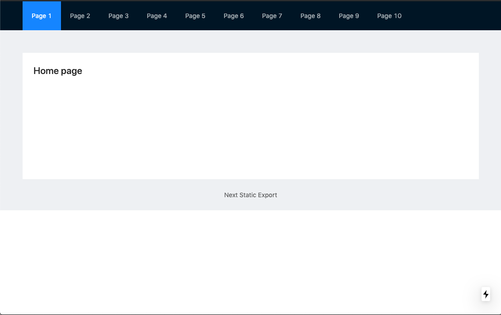

import ButtonGroup from './ButtonGroup';

## Examples
Example with imported component

<ButtonGroup items={[{name: 'NextJS Demo Site', link: 'https://static-next.netlify.com/'}, {name: 'GatsbyJS Demo Site', link: 'https://static-gatsbyjs.netlify.com/'}]} />




With video
<Video src="/react-optimization-demo" />

With codesandbox: `Something`, `Something Else`:

<Sandbox src="https://codesandbox.io/embed/react-performance-1-hb07j?expanddevtools=1&hidenavigation=1&fontsize=14" title="React Performance (Initial)" />

### Code highlighting for `<App />`

<!-- prettier-ignore -->
```jsx
const App = () => {
  console.log("Rendering <App />");

  const [items, setItems] = useState(initialState);
  const [newItem, setNewItem] = useState({ value: "", id: uuid() });

  const addItem = event => {
    event.preventDefault();
    if (newItem.value === "") return;
    setItems([...items, newItem]);
    setNewItem({ value: "", id: uuid() });
  };

  const handleRemove = id => {
    setItems(prevItems => prevItems.filter(item => item.id !== id));
  };

  return (
    <div className="App">
      <form onSubmit={addItem}>
        <input
          placeholder="New number"
          type="number"
          value={newItem.value}
          onChange={({ target: { value } }) =>
            setNewItem({ value, id: newItem.id })
          }
        />
        <input type="submit" value="Add" />
      </form>
      <ListOfItems items={items} onRemove={handleRemove} />
    </div>
  );
};
```