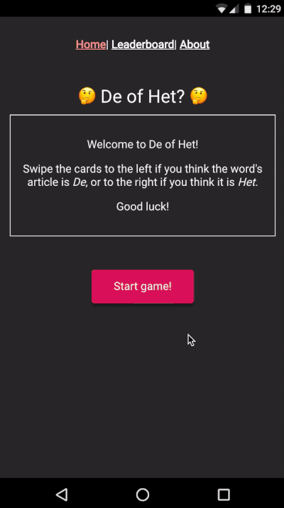

This project is an idea to help out who is learning Dutch. The Dutch language is pretty interesting, however there are certain things in the language that have no rules 
(such as using articles de or het), which makes it difficult to learn. This game brings a different yet funny way of memorizing articles and pronunciation of each word.

The game has rounds of 8 words, and you have you swipe to the side of the article that word belongs to. The app uses the SpeechSynthesis API to read the words out loud (I would never know how to properly pronounce them otherwise). You can see it in action here:

